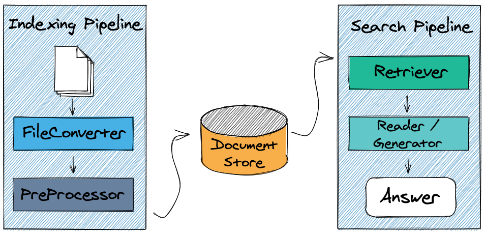

Technologies
------------

MAL Haystack is built on top of two foundational technologies:

1. Pandas
2. Haystack

Pandas
++++++

`Pandas <https://pandas.pydata.org>`_ is a fast, powerful, flexible and easy to
use open source data analysis and manipulation tool, built on top of the Python
programming language. Pandas features two fundamental data structures:
:class:`pandas.Series`, which are one-dimensional labeled arrays, and
:class:`pandas.DataFrame`, which are two-dimensional labeled structures with
potentially different datatypes for each column. DataFrames function much
like a dictionary of Series, and can be thought of like a spreadsheet or
SQL table.

MAL Haystack capitalizes on Pandas native support for creating DataFrame
objects directly from CSV files:

.. code-block:: python

   import pandas as pd

   dataframe = pd.read_csv('MAL Anime Reviews 85k.csv')

With the data cast as a DataFrame, basic metadata extraction for each of
the rows (or alternatively, records) in the dataset becomes simple. For
example, "Title" column data can be extracted from the third row
(remember: row 3 with zero-based indexing will have index 2) can be
done as follows:

.. code-block:: python

   >>> import pandas as pd
   >>> dataframe = pd.read_csv('MAL Anime Reviews 85k.csv')
   >>> dataframe.loc[3]['Anime Title']
   'Full Metal Alchemist: Brotherhood'

Columns which contain "documents" (in the form of long strings) can be
extracted in the same way, making possible the application of downstream
tools for more powerful semantic search.

Haystack
++++++++

`Haystack <https://haystack.deepset.ai>`_ is an open-source framework for
building search systems that work intelligently over large document
collections. Haystack itself is built on several foundational
technologies, including:

* The latest transformers (TODO: footnote) models (e.g., BERT, RoBERTa,
  MiniLM, DPR)
* A multitude of databases (e.g., ElasticSearch, Milvus, FAISS, SQL)

Architecturally, Haystack features three "levels" of components:

1. **Nodes** perform different kinds of text processing, which can
   range from preprocessing tasks (e.g., paragraph splitting) to
   storage tasks (e.g., writing documents to a document database) to
   powerful model-based tasks like classification and question
   answering.

2. **Pipelines** allow Haystack users to *combine* nodes to define
   their own data flows. For example, preprocessing and classification tasks
   can be combined into a single pipeline to create document stores where
   each document is annotated with their class.

   Haystack supports two general flavors of pipeline designed to work
   together: *indexing pipelines* to prepare your data for search (by
   writing them to a *document store*), and *querying pipelines* to
   perform searches on a set of documents in a document store.

   An example of indexing and querying pipelines, each with two nodes.

3. **REST APIs** to enable delivery not just of simple Python scripts,
   but of web services designed to work in production environments.

MAL Haystack leverages Haystack with indexing and querying pipelines
very similar to those in the figure above. With some custom nodes (TODO: footnote),
Haystack enables construction of indexing pipelines to convert strings embedded
in CSV columns to documents in a document store:

.. code-block:: python

   from haystack import Pipeline

   # NOTE: converter, preprocessor, doc_store created out of scope

   p = Pipeline()
   p.add_node(component=converter, name="CSVConverter", inputs=["File"])
   p.add_node(
       component=preprocessor, name="PreProcessor", inputs=["CSVConverter"])
   p.add_node(
       component=doc_store, name="DocumentStore", inputs=["PreProcessor"])

   p.run(file_paths=["MAL Anime Reviews 85k.csv"])

With a document store prepared, a querying pipeline for question answering
might look like this:

.. code-block:: python

   from haystack import Pipeline

   p = Pipeline()
   p.add_node(component=retriever, name="ESRetriever1", inputs=["Query"])
   p.add_node(component=reader, name="QAReader", inputs=["ESRetriever1"])
   res = p.run(query="Who is the main character of the show?")

How MAL Haystack builds upon these technologies to meet its :ref:`objectives`
is described next, in the :ref:`implementation` section.